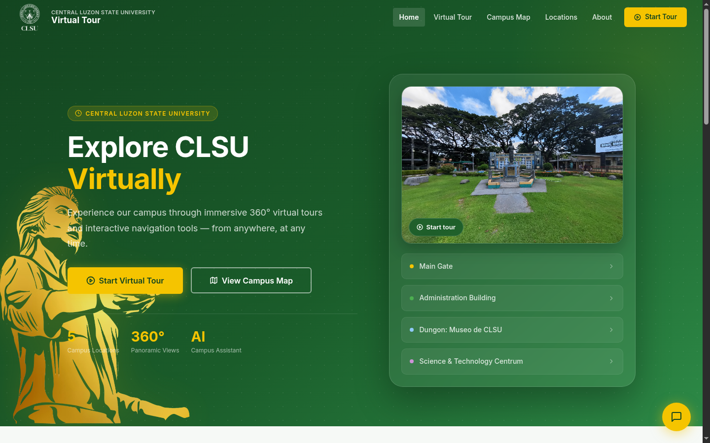
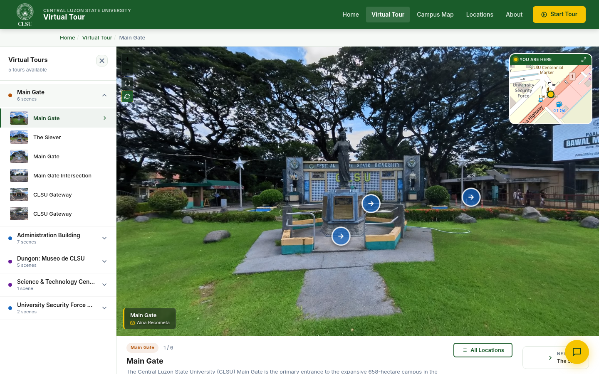
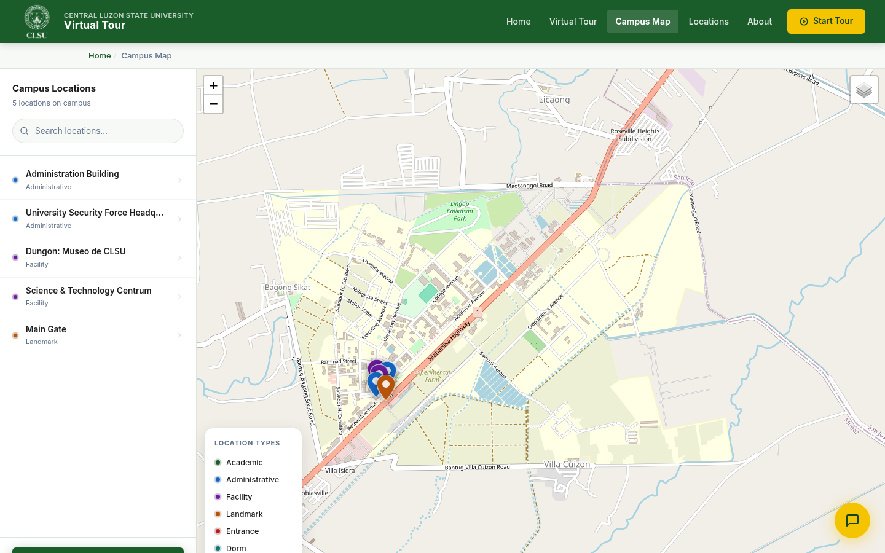
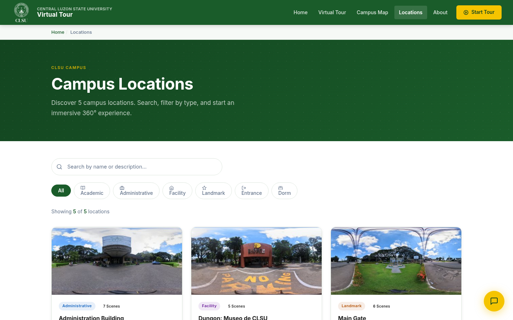

<!--
  Showcase README for the CLSU Virtual Tour capstone.
  This repo is documentation only — the source code is private.
-->

<h1 align="center">🏛️ CLSU Virtual Tour</h1>

  <em>An immersive, web-based 360° virtual tour of Central Luzon State University — 
  explore the campus remotely through panoramic views, an interactive map, and an AI guide.</em>

  
  
  
  
  
  
  

---

## 📖 Overview

**CLSU Virtual Tour** is an interactive web platform that lets students, prospective
enrollees, visitors, and stakeholders explore the campus of **Central Luzon State
University** (Science City of Muñoz, Nueva Ecija, Philippines) from anywhere.

Instead of a static gallery, the system stitches real 360° panoramas into navigable
*routes* — you walk from one location to the next through clickable hotspots, check
where you are on a live campus map, and ask an AI assistant for directions and
facility information along the way.

> This is an undergraduate **capstone project** for the Bachelor of Science in
> Information Technology at CLSU.

---

## ✨ Key Features

### For Visitors
- **360° Panoramic Tour** — fully navigable equirectangular panoramas powered by a
  smooth WebGL viewer, with auto-rotation and fullscreen support.
- **Interactive Hotspots** — in-scene markers to move between viewpoints, jump to a
  different campus location, read information, or open media.
- **Interactive Campus Map** — a Leaflet + OpenStreetMap map pinned to every tour
  location, plus a live "you are here" mini-map inside the tour.
- **AI Campus Assistant** — a Google Gemini–powered chatbot scoped to CLSU, answering
  navigation and facility questions and able to deep-link you straight to a location.
- **Visitor Registration** — a lightweight "I am a…" flow that tailors the experience
  for students, alumni, and guests.
- **Fully Responsive** — designed mobile-first for phones, tablets, and desktops.

### For Administrators
- **Tour Builder CMS** — create tour *routes*, upload panoramic *scenes*, and place
  *hotspots* visually on the panorama — no code or raw JSON required.
- **Searchable Management** — live search across routes, scenes, and locations.
- **Automatic Panorama Compression** — massive ~40 MB 360°-camera exports are
  downscaled and optimized on upload for fast, mobile-friendly loading.
- **Built-in Privacy Blur Tool** — permanently blur faces, plates, or signage directly
  onto a panorama, with a one-click restore to the original.
- **Interactive Map Editor** — place and reposition location pins on a map picker.
- **Usage Analytics** — track tour sessions, visited locations, and visitor stats.
- **ISO/IEC 25010 Evaluation** — a built-in software-quality survey and results view.

---

## 🖼️ Screenshots

| Homepage | 360° Tour Viewer |
|:---:|:---:|
|  |  |
| **Interactive Campus Map** | **Locations Gallery** |
|  |  |

---

## 🧱 Tech Stack

| Layer | Technology |
|---|---|
| **Backend** | PHP 8 (framework-free), MySQL 8 via PDO (prepared statements) |
| **Frontend** | Vanilla HTML5, CSS3, JavaScript (ES6+) — no frontend framework |
| **360° Viewer** | [Pannellum](https://pannellum.org/) |
| **Campus Map** | [Leaflet.js](https://leafletjs.com/) + OpenStreetMap |
| **AI Chatbot** | Google Gemini API (server-side) |
| **Typography** | Inter |

### Engineering Highlights
- **Security-first:** 100% PDO prepared statements, CSRF protection on all forms and
  APIs, hardened sessions, output escaping, and a fully decoupled admin panel.
- **Portable deployment:** base-less media paths resolve to any domain or subfolder
  from a single config value.
- **Image pipeline:** server-side GD compression, thumbnail generation, and
  equirectangular-aware privacy blurring.

---

## 🎨 Design System

A clean, university-grade visual identity built around the CLSU brand:

| Token | Value |
|---|---|
| Primary (Dark Green) | `#1a5c2a` |
| Accent (Gold) | `#f5c400` |
| Typeface | Inter |

---

## 👥 Team

Developed as a capstone project by BSIT students of **Central Luzon State University**:

- **Cruz, Jimwell J.**
- **Recometa, Aina Patrice R.**
- **Victoria, Angelo M.**

**Adviser:** Dr. Cristian Rey C. Seco

---

## 📄 License & Usage

**© 2026 CLSU Virtual Tour Team. All Rights Reserved.**

This repository is a **project showcase**. The application's source code is
proprietary and is **not** publicly available or open source. The screenshots,
branding, and descriptions here are provided for portfolio and informational
purposes only and may not be reused without permission.

---

Central Luzon State University · Science City of Muñoz, Nueva Ecija, Philippines

